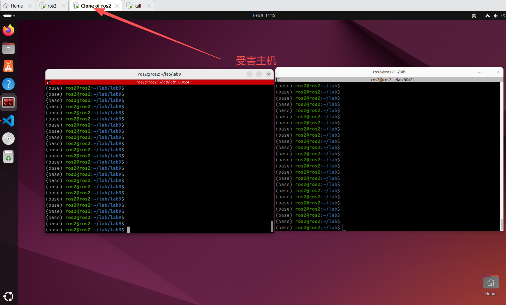
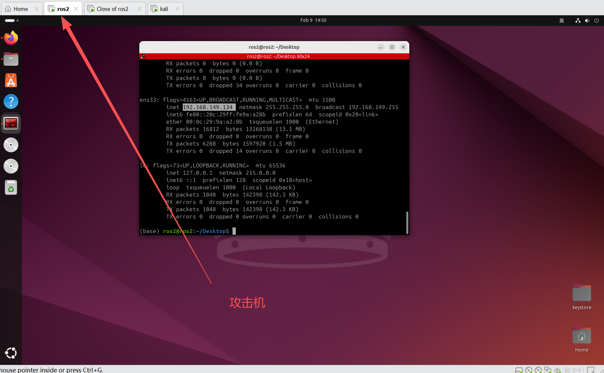
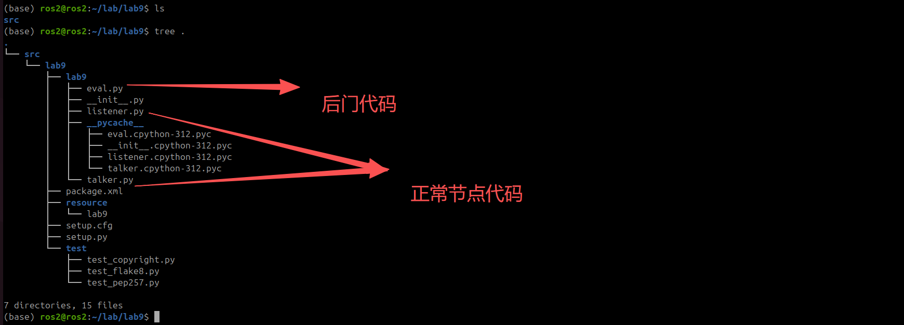
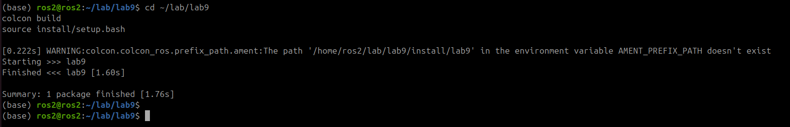
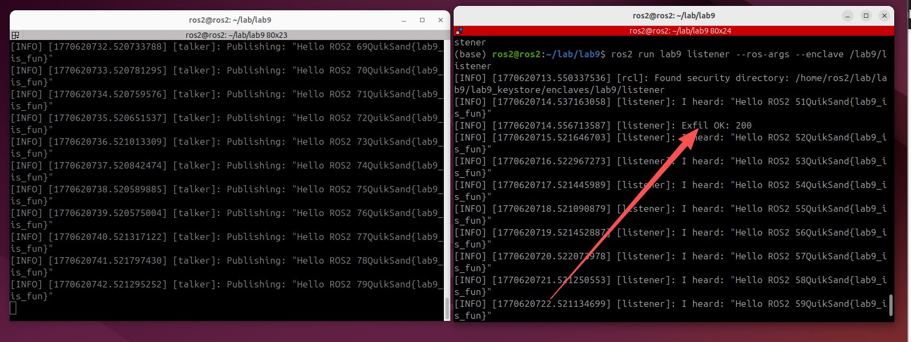
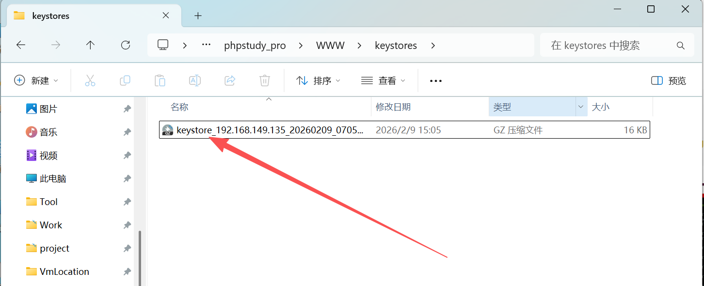
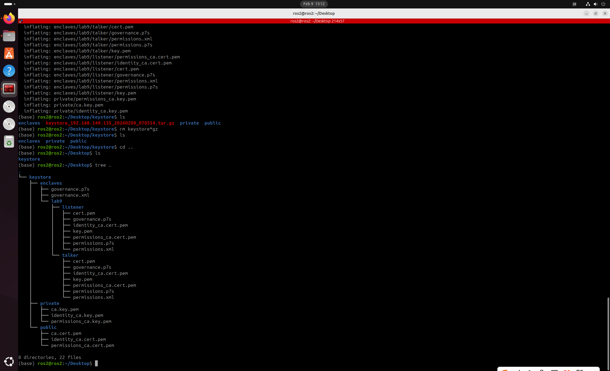
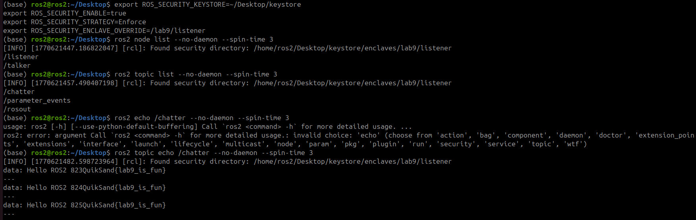

本靶场用于演示SROS2 供应链攻击（Keystore 泄露）攻击
## 攻击目标
通过恶意包/库污染开源或构建过程，盗取 SROS2 keystore 或注入恶意节点。

### 靶场情境设计

提供带 “后门 code signing / keystore exfiltration” 的源码包。

攻击脚本尝试在构建时写入恶意步骤，将 keystore 通过隐蔽 DNS/HTTP 渠道发送。

利用泄露的 keystore 重新作为合法参与者加入 DDS 网络并查看修改关键 Topic。

### 注意
本靶场为演示源码带后门攻击代码演示，故无法开启docker环境进行演示

## 实验过程
靶机---------------->192.168.149.135
攻击机1(vps)------->192.168.149.1
攻击机2(局域网)---->192.168.149.134


使用宿主机作为vps进行相关演示

#### 下载带有后门代码


**项目结构**


### 受害者编译代码
```bash
cd ~/lab/lab9
colcon build --symlink-install
source install/setup.bash
```


## 生成密钥库
```bash
cd ~/lab/lab9
ros2 security create_keystore lab9_keystore
```

### 生成密钥和证书

```bash
ros2 security create_enclave lab9_keystore /lab9/talker

ros2 security create_enclave lab9_keystore /lab9/listener
```

### 配置环境变量
```bash
export ROS_SECURITY_KEYSTORE=~/lab/lab9/lab9_keystore
export ROS_SECURITY_ENABLE=true
export ROS_SECURITY_STRATEGY=Enforce
```

### 运行 talker/listener演示

```bash
ros2 run lab9 talker --ros-args --enclave /lab9/talker

ros2 run lab9 listener --ros-args --enclave /lab9/listener
```


后门执行成功


keystore成功被盗取

将vps上的keystore放入在局域网中的另外一台攻击机中并解压



### 配置安全环境变量从而进行监视和篡改
此处用监视为例
```bash
export ROS_SECURITY_KEYSTORE=~/Desktop/keystore
export ROS_SECURITY_ENABLE=true
export ROS_SECURITY_STRATEGY=Enforce
export ROS_SECURITY_ENCLAVE_OVERRIDE=/lab9/listener
```
此处的`~/Desktop/keystore`需要与你自己的keystore存储的位置相符


### 进行监视

成功得到敏感数据

`QuikSand{lab9_is_fun}`
